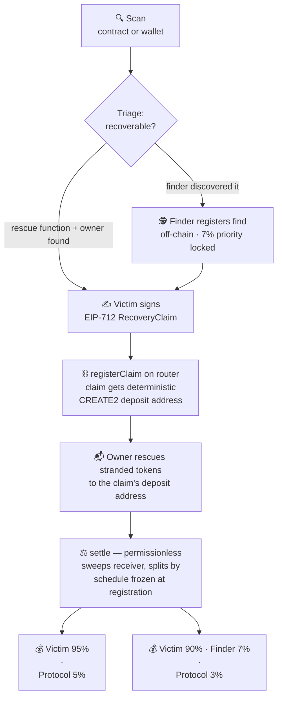

# Salvage

**A recovery protocol for tokens stranded in smart contracts — with a reference application.**


[**Live app**](https://usesalvage.xyz) · [**Base App Mini App**](https://salvage-miniapp.vercel.app) · [**X @Salvage_xyz**](https://x.com/Salvage_xyz) · [**Farcaster @Salvage-xyz**](https://warpcast.com/salvage-xyz) · gethelp.salvage@gmail.com

Millions of dollars sit stranded inside smart contracts — sent there by mistake and assumed gone forever. The USDC contract alone holds over **$220K** in tokens people accidentally transferred to it ([verify the balances yourself on Etherscan](https://etherscan.io/tokenholdings?a=0xa0b86991c6218b36c1d19d4a2e9eb0ce3606eb48)).

Salvage is the missing standard for getting them back: **scan** any contract or wallet for stranded value, **triage** whether it's technically recoverable, and **settle** the recovery trustlessly on-chain. The web app is the reference implementation — the protocol underneath is built to be integrated by wallets, explorers, and support tooling.

---

## Live proof — a real recovery on Base mainnet

This isn't hypothetical. Here is a complete recovery executed through Salvage on Base, every step verifiable on-chain:

| Step | Transaction |
|---|---|
| 1. **The loss** — 1 DAI sent directly to the cbBTC token contract | [`0x7da3…a4c1`](https://basescan.org/tx/0x7da304788c1fd9b2f02e8a313ea9c0881e5d34d28cbdc9943b367139535ca4c1) |
| 2. **Claim registered** — victim signed an EIP-712 claim; router assigned deposit address [`0x3967…EFa3`](https://basescan.org/address/0x3967BfCB4A04173b9f5B735831D0D38c0549EFa3) | [`0xd202…1ae9`](https://basescan.org/tx/0xd20241abf6f4bdddd91dbd72190a9a5037cd92920689e677a7a0265118601ae9) |
| 3. **Receiver funded** — 1 DAI rescued into the claim's deposit address | [`0x4654…1531`](https://basescan.org/tx/0x4654e00d88dff48ab91b7a4b9388e75e5d61fc8121b82bd6ab889acb702b1531) |
| 4. **Settlement** — permissionless `settle()`: **0.95 DAI → victim, 0.05 DAI → protocol**, exact 95/5 split in one transaction | [`0x7c6b…b51b`](https://basescan.org/tx/0x7c6ba90f73bec7accf15ec8f92bbf92fbd0e509685d5aa819ca26aca7c05b51b) |

Claim ID: `0xa0c54e183faab63c4ea488fd81ef24a61d190d43c6c063684c1a8a6e84878666`

## How a recovery flows



## What it does

### 🔍 Contract Scanner
Paste any ERC-20 contract on Ethereum or Base. Salvage:
- Sweeps **every token balance** the contract holds (paginated discovery + guaranteed pass on major tokens)
- Prices holdings via Alchemy Prices API (hybrid by-symbol / by-address, spam-filtered)
- Runs **recovery triage**: Is the contract verified? Does its ABI expose a rescue function (`rescueERC20()` and friends)? Is it an upgradeable proxy? Is there an owner who can act?
- Verdict: **Recoverable · Needs Action · Unrecoverable** — plus a ready-to-send outreach message for the contract's team

> **Triage caveat:** the scanner detects the *presence* of rescue functions and ownership patterns in the ABI — it does not verify whether the owner can or will actually act. A `rescueERC20()` gated behind a timelock, or an `owner()` pointing at a multisig that's lost its signers, still reads as "Recoverable" today. Treat the verdict as "a path plausibly exists," not a guarantee.

### 🕵️ Finder registration
Anyone can discover a stranded balance before the affected team or victim does. Registering a find is **off-chain and gasless**: the finder signs a plain message (EIP-191, via `signMessage`) agreeing to the fee schedule, and it's recorded in Supabase under a deterministic `find_key` — first writer wins, enforced by a unique constraint (`409` for anyone who tries to register the same find afterward). No victim signature is required at this stage; it only locks in *priority* on the 7% finder fee.

- **Abuse case:** could a victim register themselves as their own finder to dodge the fee split? No — `registerClaim()` on-chain rejects `finder == victim` ([`SalvageRecoveryRouter.sol`](contracts-hardhat/contracts/SalvageRecoveryRouter.sol)), so even if an off-chain registration slipped through, the on-chain claim (and payout) can never settle with the finder and victim as the same address.
- **Victim contact today is manual** — the finder reaches out with the app's generated outreach message. Automated reverse-lookup (Basename/ENS, Farcaster) is on the roadmap, not built yet.

### 🕵️ Did I Lose Tokens?
Paste your wallet address. Salvage scans your transfer history for the classic mistake — tokens sent **directly to a token contract's own address** — verified on-chain via calldata analysis (fee-on-transfer side effects are excluded by construction). Each finding shows what you lost, whether the contract still holds it, and whether a recovery path exists.

### 📱 Base App Mini App
Salvage runs natively inside the Base App as a Mini App. Open it and your wallet is already connected — one tap scans it for recoverable tokens, no site navigation or copy-paste. Findings link straight back to the full recovery flow. Built with MiniKit / OnchainKit; registered on Base.dev. Wallet-address opt-in captures interest for recovery alerts (delivery pending Base's notifications API).

### ⚖️ On-chain Recovery Settlement
Recovery never depends on trusting anyone:

1. Victim signs an **EIP-712 RecoveryClaim** (token, victim, finder, loss tx, deadline)
2. Each claim gets its own **deterministic CREATE2 deposit address**
3. The contract owner rescues the stranded tokens to that address
4. `settle()` is **permissionless** — sweeps the receiver and splits automatically

**Fee schedule (frozen per claim, enforced by contract):**
| Flow | Victim | Finder | Protocol |
|---|---|---|---|
| Victim-initiated | 95% | — | 5% |
| Finder-brokered | 90% | 7% | 3% |

## Deployed contracts

| Contract | Ethereum | Base |
|---|---|---|
| **SalvageRecoveryRouter** | [`0xD9A5f1Fcf39F99152d6443132B21C1D8f7fAAC25`](https://etherscan.io/address/0xD9A5f1Fcf39F99152d6443132B21C1D8f7fAAC25#code) | [`0x2240792d1A9D964d238bD693fCb09586B10faEdf`](https://basescan.org/address/0x2240792d1A9D964d238bD693fCb09586B10faEdf#code) |
| **SalvageFeeContract** | [`0xd21c72FBE27B6Cd26A5DBf49148B7bA0a4CAed27`](https://etherscan.io/address/0xd21c72FBE27B6Cd26A5DBf49148B7bA0a4CAed27#code) | [`0xd21c72FBE27B6Cd26A5DBf49148B7bA0a4CAed27`](https://basescan.org/address/0xd21c72FBE27B6Cd26A5DBf49148B7bA0a4CAed27#code) |

Both routers verified on **Etherscan/Basescan, Blockscout, and Sourcify**.

## Security model

The router is designed so most attacks die by construction:

- **Per-claim CREATE2 receivers** — no shared pot; claims can never be confused or cross-drained
- **Front-running `settle()` is harmless** — payout addresses and splits are frozen at registration; a front-runner just pays your gas
- **No admin path to funds** — the owner can only change where *future* protocol fees go (two-step ownership); claim receivers are untouchable even with a compromised key
- **Non-upgradeable, zero external dependencies, no delegatecall**
- **EIP-712 signatures** with deadline expiry and EIP-2 malleability rejection
- **Balance-delta accounting** — fee-on-transfer tokens split correctly
- **Residual-safe** — `settle()` can run again if more tokens arrive later

Test suite: 10/10 passing (`npx hardhat test`) covering both fee paths, deterministic receiver prediction, residual settlement, forged/expired/duplicate signatures, fee-on-transfer math, and ownership.

## Stack

- **Frontend:** Next.js 14 · TypeScript · wagmi v2 / viem
- **Data:** Alchemy (RPC, Token API, Prices API) · Etherscan API V2 · Supabase (leaderboard, claims registry)
- **Contracts:** Solidity 0.8.20 · Hardhat 3 · Ignition deploys · node:test + viem test suite
- **Chains:** Ethereum + Base
- **Base App:** MiniKit / OnchainKit Mini App · registered on Base.dev · wallet-address notification opt-in

## Repo layout

```
src/
  app/api/         scan, victim-scan, claims, leaderboard, stats
  components/      dashboard, scanner UI, recovery claim panel
  lib/             scanner (triage), sweeper (balances+pricing), victim (loss detection)
contracts-hardhat/
  contracts/       SalvageRecoveryRouter.sol, SalvageFeeContract.sol
  test/            router test suite
  ignition/        deployment modules + records (chain-1, chain-8453)
```

> The Base App Mini App lives in a separate repo: [`2TheMoom/salvage-miniapp`](https://github.com/2TheMoom/salvage-miniapp)

## Running locally

```bash
npm install
cp .env.example .env.local   # Alchemy RPCs + API key, Etherscan key, Supabase keys
npm run dev
```

Contracts:
```bash
cd contracts-hardhat
npm install
npx hardhat compile
npx hardhat test
```

## Roadmap

- **v1.1 — Owner Execution:** authorized contract owners execute supported recovery functions directly from Salvage. The app detects the rescue method in the ABI, prefills parameters (token, claim receiver, amount), shows the decoded call + raw calldata, and prepares the transaction for the owner to review and sign — no Etherscan spelunking, no ABI decoding.
- **v1.2 — Recoverability Score:** every scanned contract gets a 0–100 score derived from the triage inputs (verification, rescue functions, upgradeability, ownership, proxy pattern) — one shareable number, full details underneath.
- **Claims pipeline dashboard:** registered → funded → settled tracking, with live "all-time recovered" stats.
- **Victim contact discovery:** Basename/ENS reverse-resolution and Farcaster lookup so finders can reach wallet owners.
- **Further out:** recovery APIs for wallets and explorers, protocol support portals, notifications for newly stranded assets.

## Vision

Make stranded ERC-20 recoveries as standardized and trustless as token transfers themselves. Salvage starts as a scanner and a settlement router, but the protocol is designed to become infrastructure — wallet integrations that flag stranded sends before they happen, explorer badges for recoverable contracts, support portals for protocol teams, and an SDK so any app can offer recovery natively. A single frontend is the beginning, not the ceiling.

## An honest note on recovery

Salvage finds stranded funds and builds the safest possible path to return them — but **recovery always requires the contract owner to act**. No tool can force it. What Salvage guarantees is that when an owner does act, settlement is trustless, auditable, and nobody custodies anything. If anyone DMs you promising guaranteed fund recovery for an upfront fee, it's a scam — that's exactly the pattern this protocol was designed to make unnecessary.

---

**Built by [Abu Olumi](https://x.com/Olumi441)** · Builder · Researcher · Content Creator · On-chain Contributor